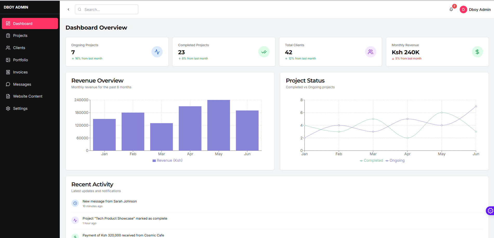
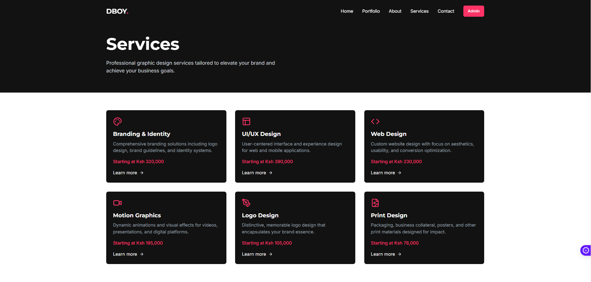
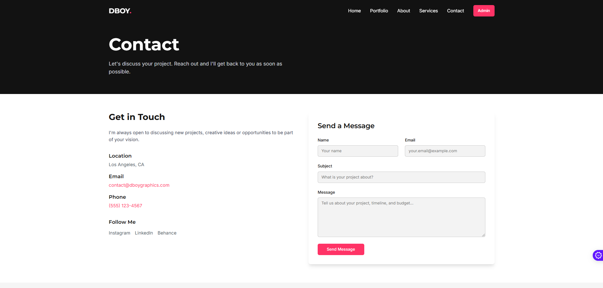

🎨 DBOY GRAPHICS – The Ultimate Graphic Design Management Web App
🚀 Manage Your Clients, Projects, and Portfolio – All in One Place!

Dboy Graphics is a powerful web app designed to streamline the workflow of graphic designers. From project management to client collaboration, invoicing, and portfolio showcasing, this web app has everything you need to elevate your design business.

🌟 FEATURES OVERVIEW
1️⃣ Dashboard – Your Creative Command Center
✅ Quick project insights
✅ Active clients & pending tasks
✅ AI-powered notifications & reminders

2️⃣ Project Management – Stay Organized Like a Pro
✅ Add, track, and manage projects
✅ Task checklist with due dates & priority levels
✅ Client collaboration & real-time feedback

3️⃣ Client Management – Build Lasting Relationships
✅ Store client details & project history
✅ Chat & email integration for seamless communication
✅ AI-suggested follow-ups & reminders

4️⃣ Portfolio Showcase – Impress and Attract New Clients
✅ Upload and categorize your best work
✅ Drag-and-drop portfolio manager
✅ AI-powered SEO optimization for better online visibility

5️⃣ Invoicing & Payments – Get Paid Hassle-Free
✅ Generate branded invoices in one click
✅ Track payments & due invoices
✅ Integrate Stripe, PayPal, or Wise for easy transactions

6️⃣ Customizable CMS – Full Control Over Your Website
✅ Update homepage text & images
✅ Manage services, pricing, and blog content
✅ Dark mode & theme customization

🛠 TECH STACK
🔹 Frontend: Next.js (React) + Tailwind CSS
🔹 Backend: Firebase / Supabase
🔹 Database: Firestore / PostgreSQL
🔹 Payments: Stripe / PayPal / Wise
🔹 Hosting: Vercel / Netlify
🔹 Security: 2FA authentication + role-based access

📌 INSTALLATION & SETUP
🔧 Local Installation
Clone the repository and install dependencies:

bash
Copy code
git clone https://github.com/your-repo/dboy-graphics.git  
cd dboy-graphics  
npm install  
npm run dev  
🚀 Your Dboy Graphics app is now running on http://localhost:3000!

🚀 ROADMAP & FUTURE UPDATES
🔜 AI-powered auto-response system for clients
🔜 Automated project deadline reminders
🔜 Multi-user roles (Admin, Editor, Assistant)
🔜 Client billing history & revenue tracking

💡 CONTRIBUTING
Want to improve Dboy Graphics? We love open-source contributions!

✔️ Fork the repo
✔️ Create a branch for your feature
✔️ Submit a pull request

💬 Feel free to open an issue for feature requests or bug reports!

📞 CONTACT & SUPPORT
📧 Email: support@dboygraphics.com
🌍 Website: www.dboygraphics.com

📸 Insert Contact Page Image Here

🎨 Designed for Creatives. Built for Productivity.
🔥 Dboy Graphics – Your All-in-One Graphic Design Business Solution! 🚀

💎 Level up your design business with the power of AI and seamless management!